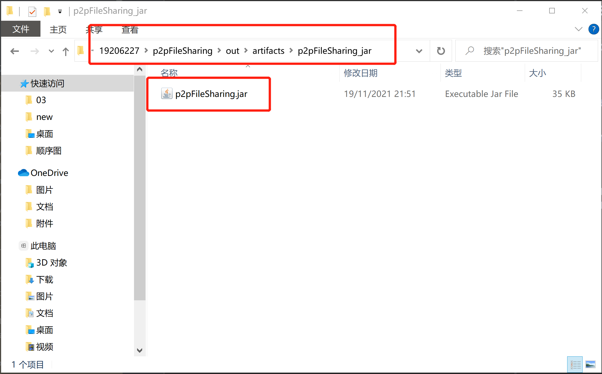
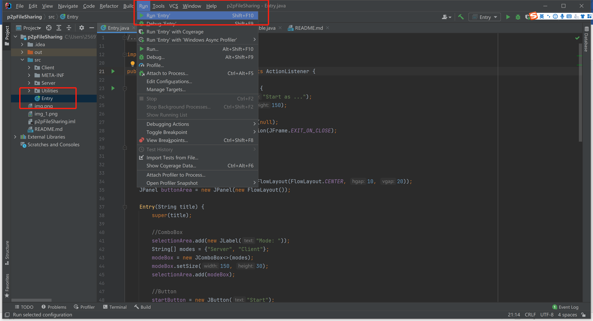

## P2P System - 19206227

### **Introduction**

This system is a P2P system that establishes file sharing with DHT. With a server running on
the network, each peer could share files with each other. Meanwhile, it delivers with a GUI
written by Swing.

###**How to run the system**
**- Method 1 -** 
1. Open the p2pFileSharing folder.
2. Open p2pFileSharing-out-artifacts-p2pFileSharing_jar.
3. Open p2pFileSharing.jar to run the system.

**- Method 2 -**
1. Open the project through IDEA.
2. Find the class Entry.
3. Run the project via the runnablue class: Entry.

###**How to use the system**
1. Start the server.
2. Start n clients.
3. Set up the clients and connect to the server.
4. Client n1 shared folder.
5. Download selected files on Client n2.
6. Disconnet clients.
7. Stop the server.
